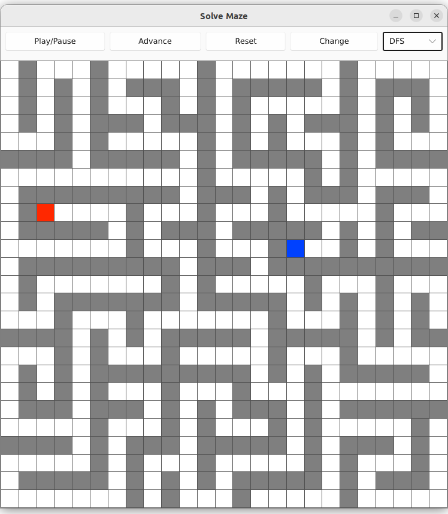

Visualize the search algorithm on the maze.

# Usage

Running the program with `cargo run --release` will launch the following window with a maze drawn on it.

# Maze

The types of squares on the maze are as follows.

| Type    | Color | Description                              |
| ------- | ----- | ---------------------------------------- |
| Passage | White | Passable square (not the start or goal). |
| Wall    | Gray  | Impassable square.                       |
| Start   | Red   | The start of the maze.                   |
| Goal    | Blue  | The goal of the maze.                    |

The search of the maze is represented as follows.

- The squares visited during the search of the maze are painted light green.
- Footprints are drawn as dark green dots (DFS only).
- When the maze search is complete, the path from start to goal is highlighted in yellow.

# Control

Control the maze search by using the widgets on the window.

## Button

The feature of each button is as follows.

| Name       | Feature                                                             |
| ---------- | ------------------------------------------------------------------- |
| Play/Pause | Toggles Play/Pause of automatic maze search.                        |
| Advance    | Advances the maze search by one step (automatic search is stopped). |
| Reset      | Initializes the maze to an unexplored state.                        |
| Change     | Creates a new maze to replace it.                                   |

## Drop-down list

The search algorithm can be selected from a drop-down list.
The following algorithms are available for selection.
- DFS (depth-first search)
- BFS (breadth-first search)
- A*

The A* algorithm uses Manhattan distance as the estimated value to the goal.

# Demonstration

The maze solved using the DFS algorithm looks like this.

<video controls src="assets/example-dfs.mp4" width=400px>
